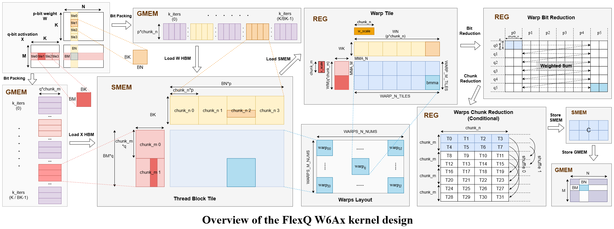
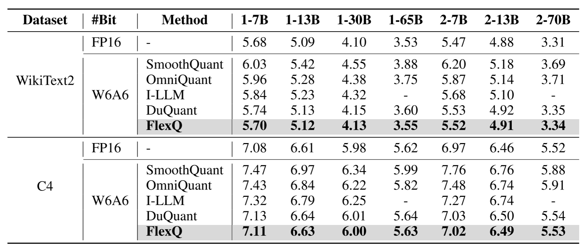
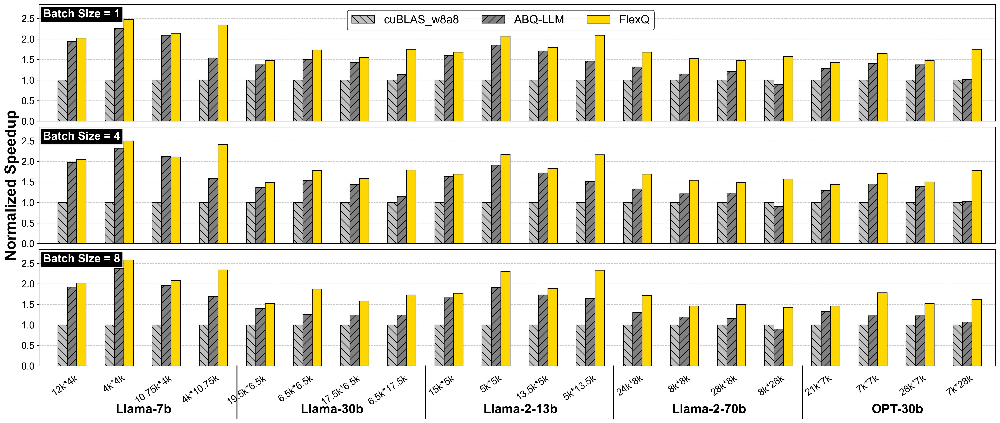
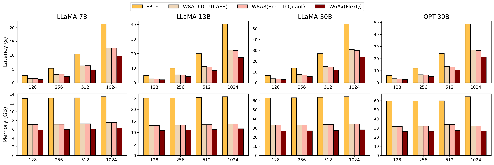

<h1 align="center">FlexQ: Efficient Post-training INT6 Quantization for LLM Serving via Algorithm-System Co-Design</h1>
FlexQ is a novel and efficient post-training INT6 quantization framework tailored for LLM inference. It combines the following design methodologies: (1) weight & activation fine-grained group quantization; (2) selective High-Precision Activation Quantization for Sensitive Network Layers; (3) dynamic activation quantization and bit-level data packing; (4) efficient W6Ax CUDA kernels co-design.



## News
- [2025/11] 🔥 Added experimental results for the LLaMA-3 model. See our v2 paper [here](https://arxiv.org/abs/2508.04405) for details.
- [2025/08] 🚀 We release the FlexQ code!
- [2025/08] 🔥 Our paper is available on arXiv!

## Abstract
Large Language Models (LLMs) demonstrate exceptional performance but entail significant memory and computational costs, restricting their practical deployment. While existing INT4/INT8 quantization reduces these costs, they often degrade accuracy or lack optimal efficiency. INT6 quantization offers a superior trade-off between model accuracy and inference efficiency, but lacks hardware support in modern GPUs, forcing emulation via higher-precision arithmetic units that limit acceleration. 

In this paper, we propose FlexQ, a novel post-training INT6 quantization framework combining algorithmic innovation with system-level optimizations. FlexQ employs uniform 6-bit weight quantization across all layers, with adaptive retention of 8-bit activations in layers identified through layer-wise sensitivity analysis. To maximize hardware efficiency, we develop a specialized high-performance GPU kernel supporting matrix multiplication for W6A6 and W6A8 representations via Binary Tensor Core (BTC) equivalents, effectively bypassing the lack of native INT6 tensor cores. Evaluations on LLaMA family models show FlexQ maintains near-FP16 accuracy, with perplexity increases of no more than 0.1 on WikiText2. The proposed kernel achieves an average 1.39× speedup over ABQ-LLM on LLaMA-2-70B linear layers. End-to-end, FlexQ delivers 1.33× inference acceleration and 1.21× memory savings over SmoothQuant.

## Install
1. Clone this repository
```
git clone https://github.com/FlyFoxPlayer/FlexQ.git
cd FlexQ
```

2. Installation of the runtime environment
```
conda create -n flexq python=3.10
conda activate flexq

cd ./FlexQ/algorithm
pip install --upgrade pip 
pip install -r requirements.txt
```

Recommended: reproducible FP16 evaluation workflow
-------------------------------------------------
If you plan to run accuracy evaluations using the Llama-2 family, the following workflow is a reliable and simple path that minimizes extra dependencies and is easiest to reproduce across machines.

1. Create and activate the Python environment (Conda is recommended):

```bash
conda create -n flexq python=3.10 -y
conda activate flexq
cd ./FlexQ/algorithm
pip install --upgrade pip setuptools wheel
pip install -r requirements.txt
```

2. Obtain access to the Llama-2-7b model on Hugging Face and download a local snapshot (required for gated models):

```bash
# install helper tools if you haven't already
pip install huggingface_hub safetensors

# interactive login (opens prompt for token)
huggingface-cli login

# (optional) download the model to a local folder to avoid on-demand downloads during evaluation
python - <<'PY'
from huggingface_hub import snapshot_download
snapshot_download(repo_id='meta-llama/Llama-2-7b-hf', cache_dir='/path/to/local/models/llama-2-7b-hf')
PY
```

Note: you must accept Meta's license on the model page and use an account that has been granted access. If you prefer not to download a local copy, the evaluation script will attempt to download the model on demand (this may be slower and requires the same access).

3. Run an example FP16 evaluation (loads model in FP16 by default):

```bash
cd ./FlexQ/algorithm
python main.py --model /path/to/local/models/llama-2-7b-hf --net Llama-2-7b --eval_ppl --deactive_amp
# or (download on demand):
python main.py --model meta-llama/Llama-2-7b-hf --net Llama-2-7b --eval_ppl --deactive_amp
```

Keep `--wbits` and `--abits` at their defaults (16) when you want to run the FP16 evaluation flow — the code triggers additional quantization steps only when those flags are set to non-16 values.

Portable environment options
----------------------------
You can keep your conda environment inside the project (a "prefix" environment) to avoid recreating a named environment every time you move hosts. Two common patterns:

- Prefix env (quick, local): create the environment inside the repository and install packages there.

```bash
# from the repository root
conda create --prefix ./flexq/.conda-env python=3.10 -y
conda activate ./flexq/.conda-env
pip install --upgrade pip setuptools wheel
pip install -r algorithm/requirements.txt
# install torch wheel appropriate for the host's CUDA (example):
pip install --index-url https://download.pytorch.org/whl/cu121/ torch==2.2.0
```

- Conda-pack (portable archive for identical hosts): use `conda-pack` to create a relocatable tarball of the prefix environment. Copy the tarball to an identical Linux host and run the bundled `conda-unpack` helper inside the unpacked folder to fix absolute prefixes.

```bash
conda install -c conda-forge conda-pack -y
conda-pack -p ./flexq/.conda-env -o ./flexq/flexq-conda-env.tar.gz
# on the destination host, extract and run:
tar -xzf flexq-conda-env.tar.gz -C <target_dir>
<target_dir>/bin/conda-unpack
```

Important: CUDA / PyTorch binary compatibility and system toolkits are still host-specific. The conda-packed environment is portable only between compatible Linux distributions/architectures with compatible drivers; PyTorch CUDA wheels may need to be reinstalled for a different driver/CUDA runtime.

## Usage
### Accuracy Evaluation
We provide several scripts to reproduce the results in our paper.
You can execute the following scripts to complete the **FP16** Accuracy Evaluation.
```
python main.py --model /Path/To/Model \
--eval_ppl --tasks piqa,arc_easy,arc_challenge,boolq,hellaswag,winogrande
```
You can execute the following scripts to complete the **FlexQ W6Ax** Accuracy Evaluation.
```
python main.py --model /Path/To/Model \
--wbits 6 --abits 6 --w_group_size 128 --a_group_size 128 \
--flex_linear_quant --symmetric \
--eval_ppl --tasks piqa,arc_easy,arc_challenge,boolq,hellaswag,winogrande
```
The following describes critical configuration parameters:
- `--model`: the local model path or huggingface format.
- `--wbits`: weight quantization bits.
- `--abits`: activation quantization bits.
- `--group_size`: group size for weight/activation quantization. If unset, defaults to per-channel quantization.
- `--symmetric`: use symmetric quantization. If unset, defaults to asymmetric quantization.
- `--flex_linear_quant`: Enables high-precision activation quantization for critical sensitivity layers. If unset, uniformly quantizes all layers based on `--wbits` and `--abits` by default.
- `--eval_ppl`: evaluating the perplexity of quantized models.
- `--tasks`: evaluating zero-shot tasks.


### Kernel Benchmark
Please complete the compilation of the FlexQ kernel first:
```
cd ./FlexQ/engine
bash build.sh
```
To obtain benchmark results for the cuBLAS(W8A8) kernel, please execute:
```
bash test_cublas_kernel.sh
```
To obtain benchmark results for the FlexQ kernel, please execute:
```
bash test_flexq_kernel.sh
```

### FasterTransformer E2E Performance
Please complete the FasterTransformer compilation (Make sure you install MPI):
```
cd ./FlexQ/e2e
bash build.sh
``` 

Modify the evaluation configuration:
```
# For LLaMA model, modify: e2e/examples/cpp/llama/llama_config.ini
# For OPT model, modify: e2e/examples/cpp/multi_gpu_gpt/gpt_config.ini

The following are the precision parameter settings for different baselines:
FP16:               int8_mode=0
W8A16 (CUTLASS):    int8_mode=1
W8A8 (SmoothQuant): int8_mode=2
W6Ax (FlexQ):       int8_mode=5
Additionally, for multi-GPU testing, you need to modify the tensor_para_size parameter (set it to the number of GPUs).
```

Run e2e efficiency evaluation:
```
cd build_release

# For single-GPU LLaMA model evaluation
./bin/llama_example

# For single-GPU OPT model evaluation
./bin/multi_gpu_gpt_example

# For multi-GPU evaluation
mpirun -n 2 ./bin/llama_example
```

## Results
### Accuracy Evaluation 
FlexQ achieves state-of-the-art (SoTA) accuracy performance at W6A6 precision. We evaluated the perplexity performance of FlexQ on the LLaMA family and OPT models.


Additionally, we further provide the performance of FlexQ on zero-shot common sense tasks.


### Kernel Performance 
FlexQ maintains superior performance across all tested LLM workloads. Specifically, with batch sizes of 1, 4, and 8, FlexQ achieves average speedups of 1.78×, 1.81×, and 1.82× over cuBLAS, and 1.24×, 1.24×, and 1.27× over ABQ-LLM, respectively.


### E2E Performance
We evaluate the end-to-end performance of FlexQ in LLaMA family and OPT models. Results on the LLaMA-13B model demonstrate that FlexQ achieves up to 2.38× inference acceleration and 2.28× memory compression relative to FP16. FlexQ delivers 1.25–1.33× speedup and 1.19–1.24× reduction in memory footprint compared to SmoothQuant.


## Acknowledgement
This repo benefits from [ABQ-LLM](https://github.com/bytedance/ABQ-LLM.git). We extend our sincere gratitude for their wonderful work.

## Citation
If you use our FlexQ approach in your research, please cite our paper:
```
@article{zhang2025flexq,
  title={FlexQ: Efficient Post-training INT6 Quantization for LLM Serving via Algorithm-System Co-Design},
  author={Zhang, Hao and Jia, Aining and Bu, Weifeng and Cai, Yushu and Sheng, Kai and Chen, Hao and He, Xin},
  journal={arXiv preprint arXiv:2508.04405},
  year={2025}
}
```
